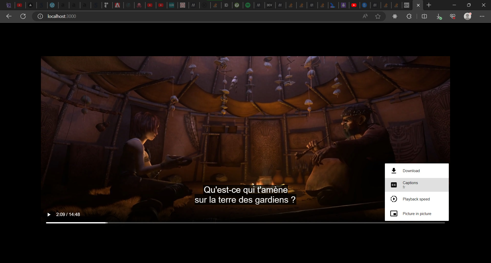

# SubSimplex

A simple, no-nonsense tool to convert subtitles for the web (WebVTT).
**_WIP_** x **_POC_**. \
_#nodejs #express #webcomponent #ffmpeg #serverless_

<details>
<summary>Tasteless intro</summary>

Lemme start by admitting that I have cancer.  
No, not IRL, but the type that lets you stay alive and suffer for at least 40 or 50 more years.

IDK why I keep procrastinating, getting sidetracked, and never getting anything done.

As Lady Amalthea (The Last Unicorn) would say, <q lang="fr">Je sens ce corps mourir !</q>, which is French but less dramatic translation of <q>I can feel this whole body dying all around me!</q>...
</details>

Suppose you have a video or movie like The Last Unicorn (obtained through legitimate means like buying the DVD, obvio). \
You want to embed it in a web page or app (say, PeerParty) in addition to the French subtitles file (e.g., `unicorn.fr.srt`). \
Unfortunately, the web supports only WebVTT (`*.vtt`).

This project is my attempt at coming up with a no-nonsense solution to convert and view subtitles on the web.

- [Live demo](https://subsimplex.vercel.app/demo/).

- [ ] Created for and used by [PeerParty](https://github.com/djalilhebal/peer-party).


## Demo

```html
<!-- Register the web component -->
<script src="./index.js"></script>

<video controls>
    <source src="sintel-1280-stereo.mp4" type="video/mp4" />
    <!-- <track default kind="subtitles" srclang="fr" src="sintel_fr.srt" /> -->
    <subsimplex-track default kind="subtitles" srclang="fr" src="sintel_fr.srt" />
</video>
```

Output:


The demo assumes that the API server is running locally:
```sh
cd server
npm start
```

As for the static server for demo:
```sh
cd server/demo
npx serve
```


## Technologies used

- [x] FFmpeg (https://ffmpeg.org/)
    * `fluent-ffmpeg`
    * https://github.com/fluent-ffmpeg/node-fluent-ffmpeg

- [x] Express

- [x] Vercel Serverless Functions

- [ ] `supertest` and Mocha for testing

- [x] Web component

- [ ] React


## Usage / Testing

Tested with:

- Edge and Chrome v119

- Node v21.2.0 (64-bit)

- Vercel CLI 32.5.6\*
    * Dev fails with Node v20 (LTS).
    * Dev feails with Node v21.2.0 (latest). It somehow installed `undici@5.26.5` even though the latest version of Node should've included `undici@5.27.0`.
    Uninstalled `vercel`, removed npm cache (`npm cache clean --force`), this doesn't fix it.
    * \* Manually replaced `vercel/node_modules/undici` with the latest version. Works.
    See https://github.com/vercel/vercel/issues/10835#issuecomment-1824020337

### Client

`client/`

Just import the Web Component and use it as you would use `<track>`.
```html
<video controls src="film.mp4">
    <!--
        <track src="film_fr.srt" />
    -->
    <subsimplex-track src="film_fr.srt" />
</video>
```

### Server

`server/` contains the Express server (`app.js`) and serverless function (`api/v0/*`).


### Serverless function

Running locally:
```sh
cd server
vercel dev
```

Now visit http://localhost:3000/demo/


## Design

Design considerations:

- No-nonsense.

- Lightweight.

- Should be a straightforward replacement for `<track>`.

- Should work well with React and other libraries/frameworks.

- Should respect the HTML5 standard.


### How it should work

Client:
```js
class SubSimplexTrack extends HTMLElement {
    static defaultApi = 'https://subsimplex.vercel.app';

    work() {
        // original = load the subtitles contents
        // converted = await fetch post to subsimplex
        // create a new track and add it or replace the old one
    }
}
```

Server:
```js
// inputs = get content and format (ext of the file) from the request
// converted = use ffmpeg to convert it to vtt
// output = return the output with correct headers
```


### Ramblings

More [Ramblings](./Ramblings.md)?


## License

[CC BY 4.0](https://creativecommons.org/licenses/by/4.0/) © Abdeldjalil HEBAL
